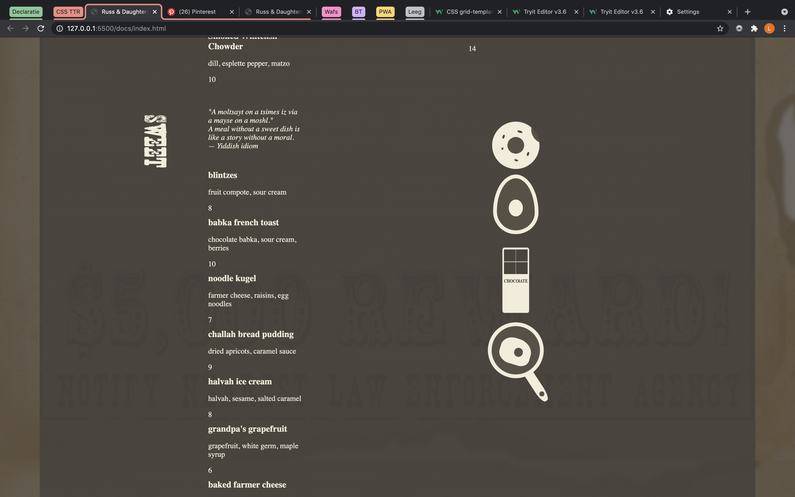
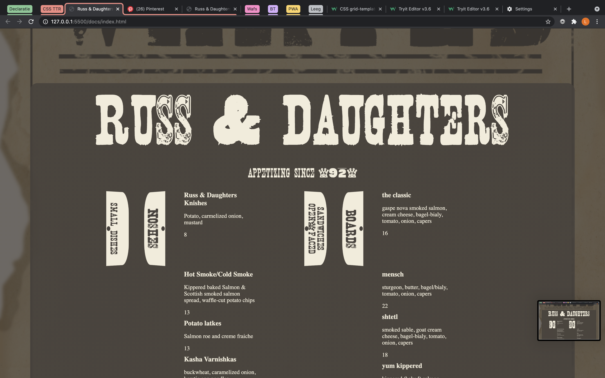

# CSS to the Rescue @cmda-minor-web 2020 - 2021 inleiding
Css to the rescue is een vak waarbij we een website gaan maken met alleen vanilla html en css. 

# Table of content
- Link naar demo
- Eindopdracht keuze
- Content
- Per week
- Done & to do

## Link naar demo
Link naar live demo: https://lottetekulve.github.io/css-to-the-rescue-2021/

## Eindopdracht keuze
De eindopdracht die ik gekozen heb ik de CSS zen garden, responsive restaurant menu.
Context:
- prefers-color-scheme

Minimaal twee eisen:
- Twee kleuren
- Responsive zonder media queries

Voor deze opdracht ga ik een online restaurant menu maken doormidden van html en css. Hierin komen de gerechten te staan van het gekozen restaurant. Het is belangrijk dat het menu responsive is zodat het op meerdere apparaten gebruikt kan worden. Ook wil ik leuke vormpjes er bij gaan maken met verschillende technieken en deze animeren.

## Content
Hieronder zie je aantal van de vormen die ik gemaakt heb. Hierbij zijn allerlei verschillende methodes gebruikt.
 

 Zie hier wat voor font ik gebruik en hoe de indeling is van de html elementen.
 

 ## Per week
 ### Week 1:
 In week 1 ben ik bezig geweest met kleuren paletten en heb ik een klein deel van de content op de pagina geplaatst.
 Ik kwam al snel op het idee dat ik een soort wanted poster voor het menu wilde maken. Dus ik keek naar bruin tinten. Daarnaast keek ik naar fonts en hoe deze posters uitgelijnd worden.

### week 2:
In deze week heb ik voor alle teksten grid gemaakt. Er zitten zo'n 5 grids in. Ook ben ik toen de grid gelukt waren deze meteen responsive gaan maken.
Hiernaast ben ik begonnen met vormpjes maken.

### week 3:
In de laatste week ben ik bezig geweest met het afmaken van de vormen en ben ik gaan animeren. Ook heb ik hier een cool font toegepast die bij het thema van de wanted poster past. En als laatst ben ik de achtergrond papierachtig gaan maken. In de vakantie week ben ik alles gaan afronden.

## Done & To do
Dit heb ik allemaal gedaan:
- [x] Responsive zonder media queries
- [x] 2 kleuren gebruiker
- [x] Prefered-color-scheme
- [x] Geen ID's of classes
- [x] Grid voor de teksten
- [x] Vormen
- [x] Animatie
- [x] Gradients
- [x] Selectoren
- [x] Border-radius

Dit zou ik nog doen met meer tijd:
- [ ] Meer vormen en op spontane plekken
- [ ] Meer doen met de achtergrond
- [ ] Meer :before en :after gebruiken
- [ ] Clip-path meer mee spelen
- [ ] Custom properties uitproberen

